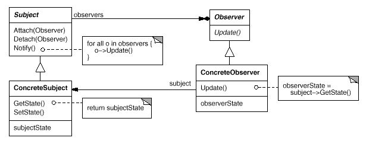

# Observer
- Intent: Define a one-to-many dependency between objects so that when one object changes state, all its dependents are notified and updated automatically.
- Also known as "Dependents" or "Publish-Subscribe".
- Use observer pattern when:
    - an abstraction has two aspects, one dependent on the other. Encapsulating these aspects in separate objects lets you vary and reuse them independently.
    - a change to one object requires changing others, and you don't know how many objects need to be changed.
    - an object should be able to notify other objects without making assumptions about who these objects are. In other words, you don't want these objects tightly coupled.

## General Structure

## Example
In my example the participants are represented as following:
- Subject: [CovidCaseManager](./publisher/CovidCaseManager.java)
- ConcreteSubject: [CovidCasePublisher](./publisher/CovidCasePublisher.java)
- Observer: [Subscriber](./subscriber/Subscriber.java)
- ConcreteObserver: [EmailNotificationSubscriber](./subscriber/EmailNotificationSubscriber.java), [SmsNotificationSubscriber](./subscriber/SmsNotificationSubscriber.java)

## Pros/Cons
Pros ❤️
- Abstract coupling between Subject and Observer - Because Subject and Observer aren't tightly coupled, they can belong to different layers of abstraction in a system. A lower-level subject can communicate and inform a higher-level observer, thereby keeping the system's layering intact.
- Support for broadcast communication - Unlike an ordinary request, the notification that a subject sends needn't specify its receiver. The notification is broadcast automatically to all interested objects that subscribed to it.

Cons 💔
- Unexpected updates - Because observers have no knowledge of each other's presence, they can be blind to the ultimate cost of changing the subject. A seemingly innocuous operation on the subject may cause a cascade of updates to observers and their dependent objects.