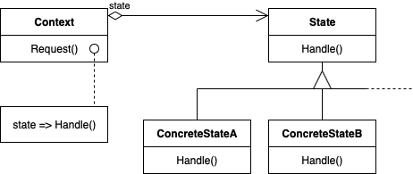

# State
- Intent: Allow an object to alter its behavior when its internal state changes. The object will appear to change its class.
- Also known as "Objects for States".
- Use State pattern when:
    - an object's behavior depends on its state, and it must change i ts behavior at run-time depending on that state.
    - operations have large, multipart conditional statements that depend on the object's state. 
      This state is usually represented by one or more enumerated constants. 
      Often, several operations will contain this same conditional structure.
      The State pattern puts each branch of the conditional in a separate class.
      This lets you treat the object's sta te as an object in its own right that can vary independently from other objects.

## General Structure

## Example
In my example the participants are represented as following:
- State: [State](./fan/states/State.java)
- Concrete State: [OffState](./fan/states/OffState.java), [LowState](./fan/states/LowState.java), [HighState](./fan/states/HighState.java)
- Context: [Fan](./fan/Fan.java)

## Pros/Cons
Pros ❤️
- Single Responsibility Principle - The State pattern puts all behavior associated with a particular state into one object. 
- Open/Closed Principle - Because all state-specific code lives in a State subclass, new states and transitions can be added easily by defining new subclasses.
- If State objects have no instance variables—that is, the state they represent is encoded entirely in their type—then contexts can share a State object. When states are shared in this way, they are essentially [flyweights](../../structural/flyweight) with no intrinsic state, only behavior.

Cons 💔
-  Applying the pattern can be overkill if a state machine has only a few states or rarely changes.