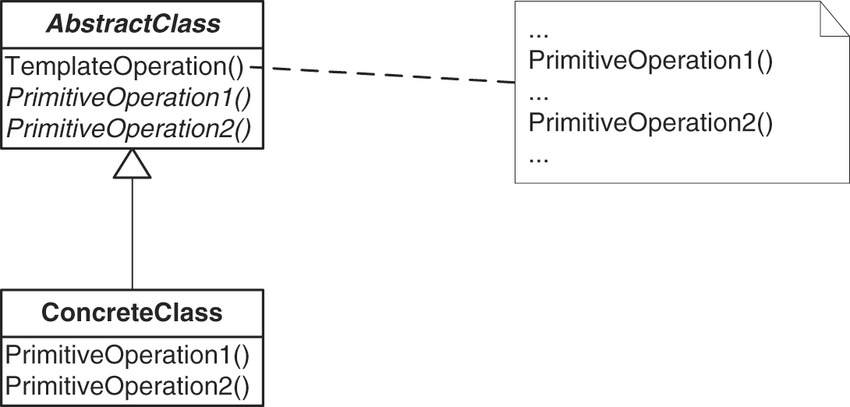

## Template Method
- Intent: Define the skeleton of an algorithm in an operation, deferring some steps to subclasses.
- Template Method lets subclasses redefine certain steps of an algorithm without changing the algorithm's structure.

## General Structure

## Example
In my example the participants are represented as following:
- Abstract Class: [EcommerceApp](./ecommerce/EcommerceApp.java)
- Concrete Class: [Amazon](./ecommerce/Amazon.java), [Ebay](./ecommerce/Ebay.java)

## Pros/Cons
Pros ❤️
- You can let clients override only certain parts of a large algorithm, making them less affected by changes that happen to other parts of the algorithm.
- You can pull the duplicate code into a superclass.

Cons 💔
- Some clients may be limited by the provided skeleton of an algorithm.
- You might violate the _Liskov Substitution Principle_ by suppressing a default step implementation via a subclass.