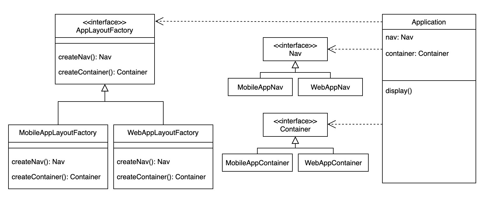

# Abstract Factory

- Provides an interface for creating families of related or dependent objects without specifying their concrete classes.
- Also known as "Kit".
- Use abstract factory pattern when:
    - a system should be independent of how its products are created, composed, and represented.
    - a system should be configured with one of multiple families of products.
    - a family of related product objects is designed to be used together, and you need to enforce this constraint.
    - you want to provide a class library of products, and you want to reveal just their interfaces, not their implementations. 
     
## General Structure

## Example

## Pros/Cons
Pros ❤️
- It isolates concrete classes. Because a factory encapsulates the responsibility and the process of creating product objects, it isolates clients from implementation classes.
- It makes exchanging product families easy. The class of a concrete factory appears only once in an application—that is, where it's instantiated. This makes it easy to change the concrete factory an application uses.
- It promotes consistency among products.

Cons 💔
- Supporting new kinds of products is difficult. Supporting new kinds of products requires extending the factory interface, which involves changing the AbstractFactory class and all of its subclasses.