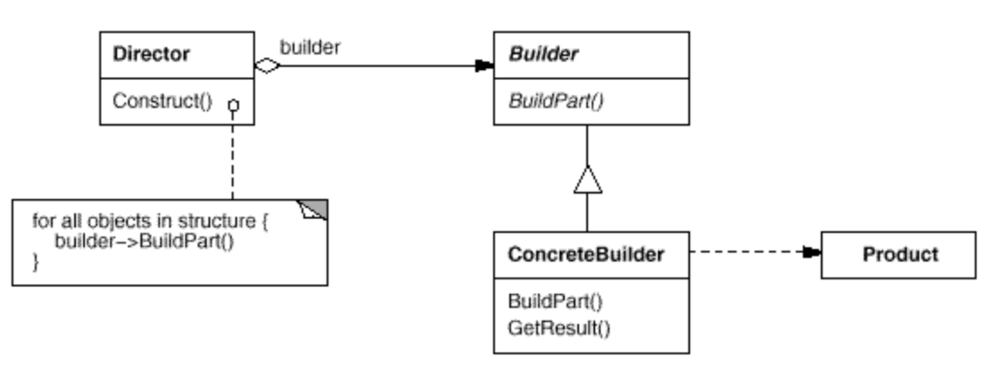

# Builder
- Intent: Separate the construction of a complex object from its representation so that the same construction process can create different representations.
- Use Builder pattern when:
    - the algorithm for creating a complex object should be independent of the parts that make up the object and how they're assembled.
    - the construction process must allow different representations for the object that's constructed.

## General Structure

## Example
In my example the participants are represented as following:
- Builder: [FoodBuilder](./burrito/FoodBuilder.java)
- ConcreteBuilder: [BurritoBuilder](./burrito/BurritoBuilder.java)
- Product: [Burrito](./burrito/Burrito.java)
- Director: [Demo](./Demo.java)

## Pros/Cons
Pros ❤️
- Provides the director with an abstract interface for constructing the product. The interface lets the builder hide the representation and internal structure of the product.
- Improves modularity by encapsulating the way a complex object is constructed and represented.
- It gives you finer control over the construction process. Unlike creational patterns that construct products in one shot, the Builder pattern constructs the product step by step under the director's control.

Cons 💔
-  The overall complexity of the code increases since the pattern requires creating multiple new classes.