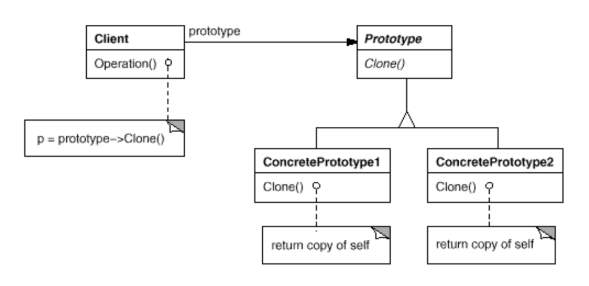

# Prototype
- Intent: Specify the kinds of objects to create using a prototypical instance, and create new objects by copying this prototype.
- Use Prototype pattern when:
    - a system should be independent of how its products are created, composed, and represented.
    - instances of a class can have one of only a few different combinations of state. It may be more convenient to install a corresponding number of prototypes and clone them rather than instantiating the class manually, each time with the appropriate state.

## General Structure

## Example
In my example the participants are represented as following:
- Prototype: [Clothes](./clothes/Clothes.java)
- ConcretePrototype: [Shirt](./clothes/Shirt.java), [Jeans](./clothes/Jeans.java)
- Client: [ClothesStorage](./storage/ClothesStorage.java)

## Pros/Cons
Pros ❤️
TODO: Update

Cons 💔
TODO: Update