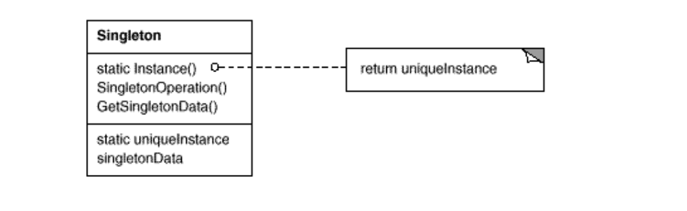

# Singleton
- Intent: Ensure a class only has one instance, and provide a global point of access to it.
- Use Singleton pattern when:
    - there must be exactly one instance of a class, and it must be accessible to clients from a well-known access point.
    - when the sole instance should be extensible by subclassing, and clients should be able to use an extended instance without modifying their code.

## General Structure

## Example
In my example the participants are represented as following:
- Singleton: [NaiveSingleton](./non_thread_safe/NaiveSingleton.java), [ThreadSafeSingleton](./thread_safe/ThreadSafeSingleton.java)

## Pros/Cons
Pros ❤️
- Controlled access to sole instance - Because the Singleton class encapsulates its sole instance, it can have strict control over how and when clients access it.
- Reduced name space - The Singleton pattern is an improvement over global variables. It avoids polluting the name space with global variables that store sole instances.
- Permits refinement of operations and representation - The Singleton class may be subclassed, and it's easy to configure an application with an instance of this extended class. You can configure the application with an instance of the class you need at run-time.
- Permits a variable number of instances - The pattern allows more than one instance of the Singleton class. You can use the same approach to control the number of instances that the application uses by changing the operation that grants access to the Singleton instance.

Cons 💔
- Violates the Single Responsibility Principle - The pattern solves two problems at the time.
- The pattern requires special treatment in a multithreaded environment so that multiple threads won’t create a singleton object several times.
- It may be difficult to unit test the client code of the Singleton because many test frameworks rely on inheritance when producing mock objects.