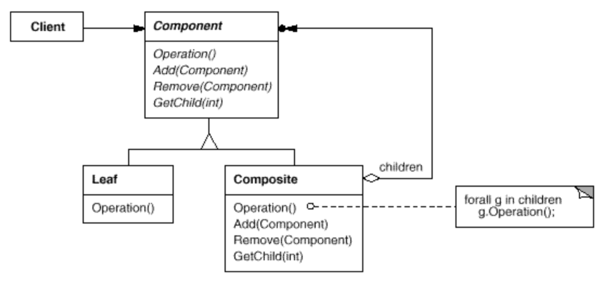

## Composite
- Intent: Compose objects into _tree structures_ to represent part-whole hierarchies. Composite lets clients treat individual objects and compositions of objects uniformly.
- Use Strategy pattern when:
    - you want to represent part-whole hierarchies of objects.
    - you want clients to be able to ignore the difference between compositions of objects and individual objects. Clients will treat all objects in the composite structure uniformly.
    
## General Structure

## Example
In my example the participants are represented as following:
- Component: [MenuComponent](./menus/MenuComponent.java) (mainMenu, settingMenu in Demo)
- Leaf: [MenuItem](./menus/MenuItem.java)
- Composite: [MenuComponent](./menus/MenuComponent.java) (shopByDepartment in Demo)
- Client: [Demo](./Demo.java)

## Pros/Cons
Pros ❤️
- Makes the client simple. Clients normally don't know (and shouldn't care) whether they're dealing with a leaf or a composite component.
- Makes it easier to add new kinds of components. Newly defined Composite or Leaf subclasses work automatically with existing structures and client code. Clients don't have to be changed for new Component classes.

Cons 💔
- Can make your design overly general. Sometimes you want a composite to have only certain components. With Composite, you can't rely on the type system to enforce those constraints for you. You'll have to use run-time checks instead.