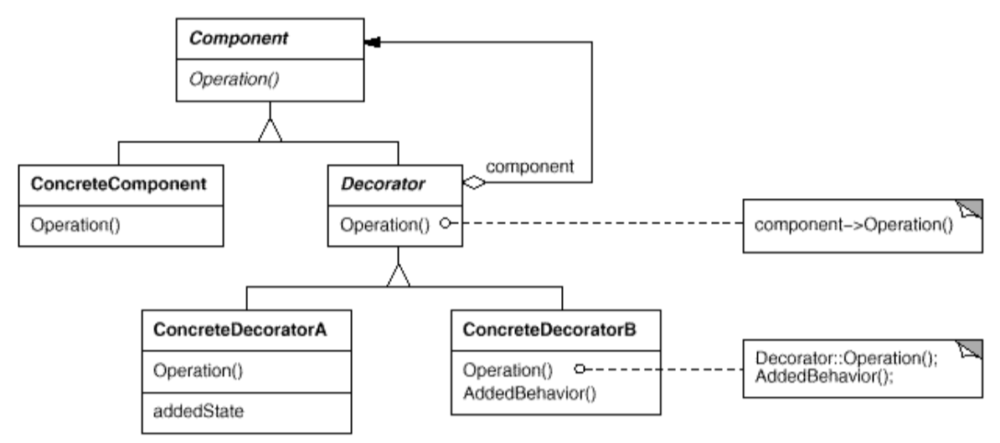

## Decorator
- Intent: Attach additional responsibilities to an object dynamically. Decorators provide a flexible alternative to subclassing for extending functionality.
- Also known as: Wrapper
- Use Decorator:
    - to add responsibilities to individual objects dynamically and transparently, that is, without affecting other objects.
    - for responsibilities that can be withdrawn.
    - when extension by subclassing is impractical. Sometimes a large number of independent extensions are possible and would produce an explosion of subclasses to support every combination. Or a class definition maybe hidden or otherwise unavailable for subclassing.

## General Structure

## Example
Participants in the example code:
- Component: [Auth](./auth/Auth.java)
- ConcreteComponent: [AuthWithPassword](./auth/AuthWithPassword.java)
- Decorator: [AuthDecorator](./auth/AuthDecorator.java)
- ConcreteDecorator: [PasswordExpiryDecorator](./auth/PasswordExpiryDecorator.java), [TwoFactorDecorator](./auth/TwoFactorDecorator.java)

## Pros/Cons
Pros ❤️
- Provides a more flexible way to add responsibilities to objects than can be had with static (multiple) inheritance. With decorators, responsibilities can be added and removed at run-time simply by attaching and detaching them.
- Avoids feature-laden classes high up in the hierarchy. Instead of trying to support all foreseeable features in a complex, customizable class, you can define a simple class and add functionality incrementally with Decorator objects.

Cons 💔
- A design that uses Decorator often results in systems composed of lots of little objects that all look alike. Although these systems are easy to customize by those who understand them, they can be hard to learn and debug.