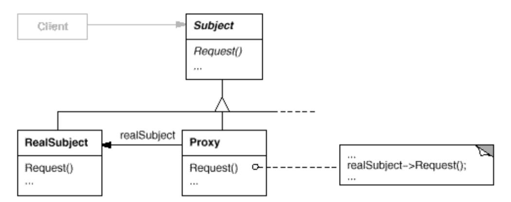

# State
- Intent: Provide a surrogate or placeholder for another object to control access to it.
- Also known as "Surrogate".
- Here are several common situations in which the Proxy pattern is applicable:
    - A **remote proxy** provides a local representative for an object in a different address space.
    - A **virtual proxy** creates expensive objects on demand.
    - A **protection proxy** controls access to the original object. Protection proxies are useful when objects should have different access rights.
    - A **smart reference** is a replacement for a bare pointer that performs additional actions when an object is accessed.
    
## General Structure

## Example
In my example the participants are represented as following:
- Subject: [ThirdPartyPhotoLibrary](./photo_library/ThirdPartyPhotoLibrary.java)
- RealSubject: [ThirdPartyPhotoLibraryImpl](./photo_library/ThirdPartyPhotoLibraryImpl.java)
- Proxy: [PhotoCacheProxy](./cache/PhotoCacheProxy.java)

Some examples in standard Java libraries include:
- `java.lang.reflect.Proxy`
- `javax.ejb.EJB`
- `javax.inject.Inject`

## Pros/Cons
Pros ❤️
- You can control the service object without clients knowing about it.
- The proxy works even if the service object isn’t ready or is not available.
- Open/Closed Principle - You can introduce new proxies without changing the service or clients.

Cons 💔
-  The response from the service might get delayed.